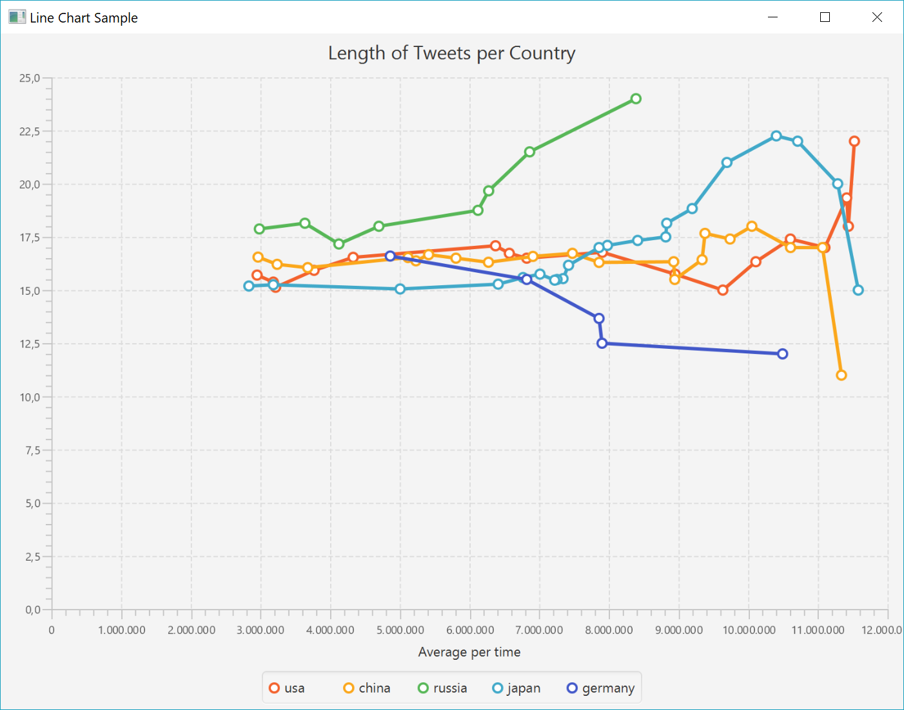

# This is the description of my BigData-Project
## Setup
First you have to checkout the project an import it as maven-project to your eclipse.
After that you have to run it with maven as usual.
To run an Application successfully you have add the following arguments at startup to the file.

--twitter-source.consumerKey [KEY] <br>
--twitter-source.consumerSecret [KEY]<br>
--twitter-source.token [KEY]<br>
--twitter-source.tokenSecret [KEY]<br>
--output [location to your recorded file]<br>

## Klasses

#### BatchGetHashesFromLocation
Gets hashtags posted in a countries.
The output looks like ([Country: Hashtags]) <br>

###### Used metrics:
```			
tweets
    //extract data from jason text
    .flatMap(new SelectTweetsWithHashtags())
    //groups hashtags
    .groupBy(0)
    //creates output string with all location
    .reduceGroup(new Reduce());
```

#### BatchGetUserOfHashtags
Gets hashtags and the user who used them in a tweet.
The output looks like ([HASHTAG],[User]) <br>

###### Used metrics:
```			
tweets
    .flatMap(new SelectTweetsWithHashtagsAndUsername())
    .groupBy(0).
    //reduces all user to a string
    reduce(new GetAllUser());
```

#### BatchLongestWordPerHashtag
finds the longes word in a tweet per hashtag.
The hashes are filtered.
The output looks like ([HASHTAG],[WORD], [LENGTH]) <br>

###### Used metrics:
```			
tweets
    .flatMap(new SelectTweetsWithHashtags())
    //filters tweets with hashtags defined in the code
    .filter(new FilterTweets())
    //returns all words with the hashtag
    .flatMap(new FlatToWords())
    .groupBy(0)
    .maxBy(2);
```
#### BatchSumHashtags
The BatchSumHashtags counts the occurrence of each hashtags.
The output looks like ([HASHTAG],[COUNT]) <br>

###### Used metrics:
```			
tweets
    .flatMap(new SelectTweetsWithHashtags())
    .filter(new FilterTweets())
    .flatMap(new FlatTweets())
    .groupBy(0)
    .sum(1);
```
#### BatchWordCountAverage
program finds tweets to a list of hashtags
and calculates its average words per tweet.
Tweets are filtered.
The output looks like ([HASHTAG],[AVERAGR],[AMOUNT_OF_TWEETS]) <br>

###### Used metrics:
```			
tweets
    .flatMap(new SelectTweetsWithHashtags())
    .filter(new FilterTweets())
    .flatMap(new WordCount())
    // groups results by its hashtags 
    .groupBy(0)
    .reduce(new Reduce());
```
#### StreamGetHashesFromLocation
Gets hashtags posted in a countries.
The output looks like ([Country: Hashtags]) <br>

###### Used metrics:
```			
tweets
    .flatMap(new SelectTweetsWithHashtags())
    //changes to keyby instead of group by
    .keyBy(0)
    .fold("", new Fold());
```
#### StreamGetUserOfHashtags
gets hashtags and the user who used them in a tweet.
The output looks like ([HASHTAG],[User]) <br>

###### Used metrics:
```			
tweets
    .flatMap(new SelectTweetsWithHashtagsAndUsername())
    .keyBy(0).
    reduce(new GetAllUser());
```
#### StreamLongestWordPerHashtag
   Finds the longes word in a tweet per hashtag by stream.
   The application is using a timewindow. 
   The output looks like ([HASHTAG],[WORD], [LENGTH])<br>
   
   ###### Used metrics:
   ```			
   tweets
       .flatMap(new SelectTweetsWithHashtags())
       .filter(new FilterTweets())
       .flatMap(new FlatToWords() )
       .keyBy(0)
       // used time window to get all values in a tumnling window with a size of 20 seconds
       .timeWindow(Time.seconds(20))
       .maxBy(2);
   ```
#### StreamSumHashtags
Counts the occurrence of each hashtags.
 The output looks like ([HASHTAG],[COUNT])<br>

###### Used metrics:
```			
tweets
    .flatMap(new SelectTweetsWithHashtags())
    .filter(new FilterTweets())
    .flatMap(new FlatTweets())
    .keyBy(0)
    //sums the second element of the result which contains many 1.
    .sum(1);
```
#### StreamWordCountAverage
 The StreamWordCountAverage program finds tweets to a list of hashtags
 and calculates its average words per tweet.
 The output looks like ([HASTAG],[AVERAGR],[AMOUNT_OF_TWEETS],[TIMESTAMP])<br>

###### Used metrics:
```			
tweets
    .flatMap(new SelectTweetsWithHashtags())
    .filter(new FilterTweets())
    .flatMap(new WordCount())
    // groups results by its hashtags 
    .keyBy(0)
    // calculates average
    .reduce(new MyReduceFunction());
```
#### CompareGetUserOfHastags
CompareGetUserOfHastags compares the results of streaming and batch-operation.
The output looks like ([HASHTAG],Batch-Value: [NONE|USER-FROM-BATCH]  Stream-Value:[USER-FROM-STREAM])
This and the other comparison programs combines batch-computing and stream-computing by comparing both <br>
result in a ProcessAllWindowFunction-function. 
<br>

###### Used metrics:
```			
public void process(
    ProcessAllWindowFunction<Tuple2<String, String>, Tuple2<String, String>, TimeWindow>.Context context,
    Iterable<Tuple2<String, String>> elements, Collector<Tuple2<String, String>> out)
            throws Exception {
        for (Tuple2<String, String> e : elements) {
            //if no value is found in the batch-data, it will be printed by 'NONE'
            String batchvalue = "NONE";
            //find hashtag in batch processed data
            if(hashmap.containsKey(e.f0)) {
                batchvalue = hashmap.get(e.f0);
            }
            String text = "Batch-Value: " + batchvalue + "  Stream-Value:" + e.f1;
            out.collect(new Tuple2<String, String>(e.f0, text));
        }
    }
```
#### CompareHashesFromLocation
CompareHashesFromLocation compares the results of streaming and batch-operation.
The output looks like ([COUNTRY],Batch-Value: [NONE|HASHTAG]  Stream-Value:[HASHTAG])
The implementation was done in a similar way to 'CompareGetUserOfHastags'.
<br>
#### CompareSumHashtags
CompareHashesFromLocation compares the results of streaming and batch-operation.
The output looks like ([HASHTAG],Batch-Value: [NONE|SUM]  Stream-Value:[SUM])
The implementation was done in a similar way to 'CompareGetUserOfHastags'.
<br>
#### RegressionLongestWordPerHashtag
RegressionLongestWordPerHashtag calculates the simple regression for the longest word in a hashtag.
The output looks like ([HASHTAG],[WORDSCOUNT],[LONGESTWORD],[PREDICTED-VALUE)<br>
For this implementation the SimpleRegression from org.apache.commons.math3 has been used. It receives a data-set of <br>
x and y and calculates all needed values. In this example I used the results of our batch-computing <br>
to train the function.  
###### Used metrics:
```			
public void processElement(Tuple3<String, Integer, Integer> value,
							ProcessFunction<Tuple3<String, Integer, Integer>, Tuple4<String, Integer, Integer, Double>>.Context ctx,
							Collector<Tuple4<String, Integer, Integer, Double>> out) throws Exception {
    
    //calculate expected value for this tweet
    double predictionpoint = (intercept + slope * value.f1);
    //output 
    out.collect(new Tuple4<>(value.f0, value.f1,value.f2, predictionpoint));
}
```
#### RegressionUserCountPerHashtag
Calculates the simple regression for the amount 
of users that uses a hashtag.
The output looks like ([HASHTAG],[USERCOUND],[PREDICTED-USERCOUND)<br>
This implementation is almost similar to 'RegressionLongestWordPerHashtag'. Only difference is that <br>
the regression object gets fed in time.<br>
###### Used metrics:
```			
		regression.addData(count, user.size());
        double pred = regression.getIntercept() + regression.getSlope() * count;
        //if prediction available
        if(!Double.isNaN(pred)) {
            out.collect(new Tuple3<String,Integer, Double>(hashtag,user.size(), pred));
        }
```
#### RegressionWordCountAverage
RegressionWordCountAverage calculates the simple regression for the average of
counted words in a hashtag
The output looks like ([HASHTAG],[Average],[PREDICTED-AVRG) <br>
The implementation is similar to 'RegressionUserCountPerHashtag'
## Videos
The videos can be found [here](Videos) 
## Result of the continuous stream data as Chart
Displays the development of average word-count of the tweets. Time is in milliseconds. <br>
Produced by [JavaFxChart.java](https://github.com/ProfGram/MyBigProject/blob/master/src/main/java/com/Project/Charts/JavaFxChart.java)



